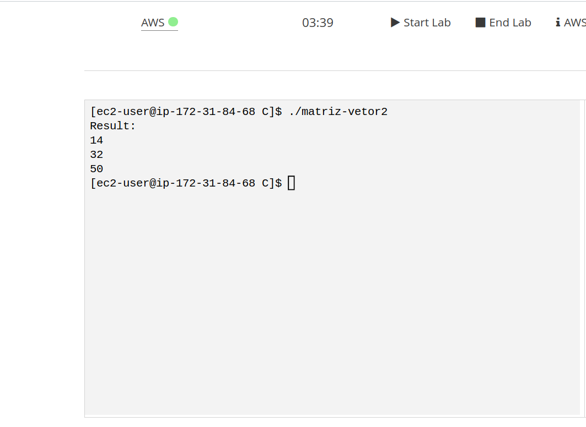

# Problema matriz vetor (Fellipe Jardanovski e Felipe Jiao)
## Problema em si
O problema da multiplicação matriz-vetor consiste basicamente
na multiplicação de uma matriz, nesse caso, uma matriz 3x3, ou seja
uma matriz com 3 linhas e 3 colunas com valores pré-definidos, com
um vetor de tamanho 3, onde os valores do vetor são os valores da
primeira linha da matriz

## Resolução com pthread
Este problema foi resolvido utilizando pthread, onde o programa cria uma thread 
para cada linha da matriz. Ou seja, o programa inicializa o índice da linha
no threadArgs[i] e cria uma thread passando a função multiplyRow e o endereço
de threadArgs[i] como argumento. Quando todas as threads forem criadas, ele utiliza
a função pthread_join para esperar a execução de cada thread, garantindo que as operações
de multiplicação sejam concluidas antes de imprimir o resultado.

## Compilar o programa
Para compilar o programa você deve utilizar o seguinte comando
```bash
gcc -o matriz-vetor matriz-vetor.c -lpthread
```

## Saída do programa

